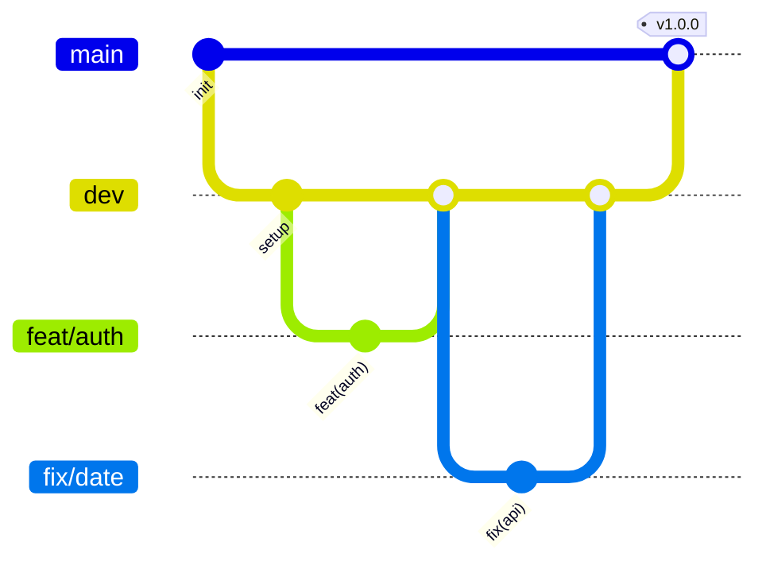

# EventHub

## Conventions de commit

Ce projet suit la spécification [Conventional Commits](https://www.conventionalcommits.org/fr/v1.0.0/).

### Format

```
type(scope): description
```

- **type** : la nature du changement (obligatoire)
- **scope** : la partie du projet concernée (optionnel)
- **description** : résumé court, à l'impératif, sans point final

### Types autorisés

| Type       | Usage                                                      |
| ---------- | ---------------------------------------------------------- |
| `feat`     | Nouvelle fonctionnalité                                    |
| `fix`      | Correction de bug                                          |
| `docs`     | Documentation uniquement                                   |
| `style`    | Mise en forme (pas de changement de logique)               |
| `refactor` | Refonte du code sans nouvelle fonctionnalité ni correction |
| `test`     | Ajout ou modification de tests                             |
| `chore`    | Maintenance, config, dépendances                           |

### Exemples

```
feat(auth): ajoute la connexion par email
fix(api): corrige le calcul de la date de fin
docs(readme): ajoute les conventions de commit
chore: configure husky et lint-staged
```

## Installation

```
npm install
```

## Hooks Git

Les hooks sont gérés par [Husky](https://typicode.github.io/husky/).

| Hook         | Action                                                                              |
| ------------ | ----------------------------------------------------------------------------------- |
| `pre-commit` | Lance `lint-staged` : Prettier formate les fichiers `*.{ts,tsx,js,json,md,yml}`     |
| `commit-msg` | Lance `commitlint` : refuse les messages qui ne respectent pas Conventional Commits |

## Workflow Git

### Branches

| Branche                                | Rôle                                       | Protégée |
| -------------------------------------- | ------------------------------------------ | -------- |
| `main`                                 | Production                                 | Oui      |
| `dev`                                  | Intégration                                | Oui      |
| `feat/*`, `fix/*`, `docs/*`, `chore/*` | Branches éphémères, supprimées après merge | Non      |

### Règles

1. Une branche éphémère part toujours de `dev`.
2. Le nom suit le type du commit : `feat/ajout-login`, `fix/calcul-date`.
3. Pas de commit direct sur `main` ni `dev` : tout passe par une Pull Request.
4. Une branche éphémère est fusionnée dans `dev` par PR, puis supprimée.
5. `dev` est fusionnée dans `main` par PR quand la version est stable (mise en production).
6. Les messages de commit respectent les Conventional Commits.

### Schéma



## Environnement de développement

```
docker compose up --build
```

Application : http://localhost:3000 (hot-reload activé).
